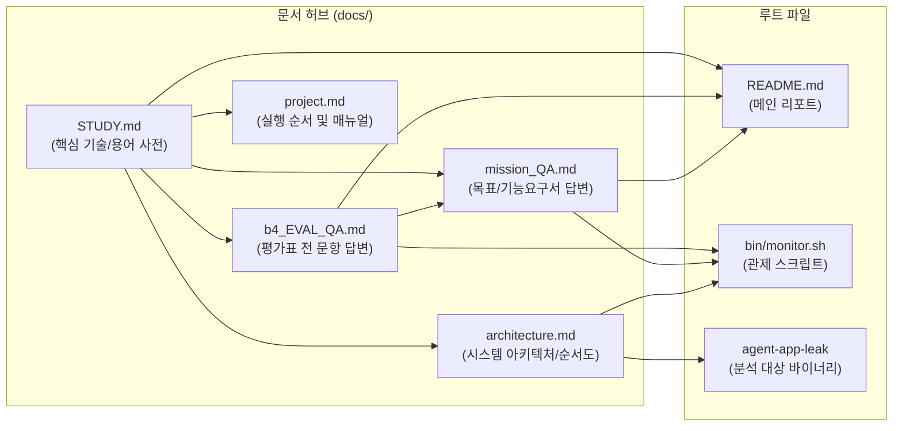

# 리눅스 시스템 트러블슈팅 핵심 기술 & 용어 학습서 (`STUDY.md`)

> **문서 목적**: 본 프로젝트(`codyssey-b4-2`)를 수행하고 시스템 장애를 진단·분석하는 데 활용된 운영체제(OS), 리눅스 커널, 동시성 프로그래밍, 관제 도구 및 아키텍처 핵심 용어와 기술 개념을 총정리한 학습 가이드입니다.  
> **관련 핵심 문서 링크**:
> - 📖 [프로젝트 메인 매뉴얼 (`../README.md`)](../README.md)
> - 🎯 [평가표(Eval) 종합 답변서 (`./b4_EVAL_QA.md`)](./b4_EVAL_QA.md)
> - 📊 [미션 목표 및 기능요구사항 Q&A 보고서 (`./mission_QA.md`)](./mission_QA.md)
> - 🏛️ [시스템 아키텍처 및 순서도 (`./architecture.md`)](./architecture.md)
> - 📋 [프로젝트 종합 가이드 (`./project.md`)](./project.md)

---

## 📑 목차
1. [프로젝트 개요 및 관련 문서 맵](#1-프로젝트-개요-및-관련-문서-맵)
2. [메모리 관리 및 가상 메모리 서브시스템](#2-메모리-관리-및-가상-메모리-서브시스템)
   - 2.1 [가상 메모리 주소 공간 (Virtual Memory Space)](#21-가상-메모리-주소-공간-virtual-memory-space)
   - 2.2 [물리 메모리 지표 (RSS vs VSZ)](#22-물리-메모리-지표-rss-vs-vsz)
   - 2.3 [페이지 캐시(Page Cache)와 버퍼(Buffer)](#23-페이지-캐시page-cache와-버퍼buffer)
   - 2.4 [스왑(Swap) 공간과 스왑 쓰레싱(Swap Thrashing)](#24-스왑swap-공간과-스왑-쓰레싱swap-thrashing)
   - 2.5 [메모리 누수(Memory Leak)와 가비지 컬렉션(GC)의 한계](#25-메모리-누수memory-leak와-가비지-컬렉션gc의-한계)
   - 2.6 [Linux 커널 OOM-Killer와 `MemoryGuard` 자가 보호 정책](#26-linux-커널-oom-killer와-memoryguard-자가-보호-정책)
3. [CPU 스케줄링 및 프로세스 실행 모델](#3-cpu-스케줄링-및-프로세스-실행-모델)
   - 3.1 [CFS (Completely Fair Scheduler)와 `vruntime`](#31-cfs-completely-fair-scheduler와-vruntime)
   - 3.2 [로드 애버리지(Load Average)와 실행 큐(Runqueue)](#32-로드-애버리지load-average와-실행-큐runqueue)
   - 3.3 [문맥 교환(Context Switching) 오버헤드](#33-문맥-교환context-switching-오버헤드)
   - 3.4 [CPU 과점유(Spike)와 기아 현상(Starvation)](#34-cpu-과점유spike와-기아-현상starvation)
   - 3.5 [3대 스케줄링 알고리즘 비교 (Round-Robin vs FCFS vs Priority)](#35-3대-스케줄링-알고리즘-비교-round-robin-vs-fcfs-vs-priority)
   - 3.6 [소프트웨어 인터럽트(SoftIRQ)와 `Watchdog` 비상 중단](#36-소프트웨어-인터럽트softirq와-watchdog-비상-중단)
4. [동시성(Concurrency)과 교착상태(Deadlock)](#4-동시성concurrency과-교착상태deadlock)
   - 4.1 [스레드(Thread), LWP(Lightweight Process) 및 멀티스레딩](#41-스레드thread-lwplightweight-process-및-멀티스레딩)
   - 4.2 [상호 배제(Mutual Exclusion)와 Mutex / Semaphore](#42-상호-배제mutual-exclusion와-mutex--semaphore)
   - 4.3 [교착상태(Deadlock) 정의 및 식사하는 철학자 모델](#43-교착상태deadlock-정의-및-식사하는-철학자-모델)
   - 4.4 [Coffman의 교착상태 4대 필수 조건](#44-coffman의-교착상태-4대-필수-조건)
   - 4.5 [Futex (Fast Userspace Mutex)와 커널 대기 큐](#45-futex-fast-userspace-mutex와-커널-대기-큐)
   - 4.6 [데드락 예방 기법 (Lock Ordering, Timeout, Lock-Free)](#46-데드락-예방-기법-lock-ordering-timeout-lock-free)
5. [프로세스 생명주기 및 리눅스 시그널(Signal)](#5-프로세스-생명주기-및-리눅스-시그널signal)
   - 5.1 [리눅스 프로세스 상태 코드 (STAT)](#51-리눅스-프로세스-상태-코드-stat)
   - 5.2 [핵심 POSIX 시그널 (`SIGKILL`, `SIGTERM`, `SIGINT`)](#52-핵심-posix-시그널-sigkill-sigterm-sigint)
   - 5.3 [종료 코드(Exit Status Code) 규칙 (137 vs 143)](#53-종료-코드exit-status-code-규칙-137-vs-143)
6. [리눅스 관제 및 시스템 진단 CLI 도구](#6-리눅스-관제-및-시스템-진단-cli-도구)
   - 6.1 [`ps` 명령어 옵션 상세 (`-ef`, `-aux`, `-L`, `-o rss=, %cpu=, wchan:`)](#61-ps-명령어-옵션-상세--ef--aux--l--o-rss-cpu-wchan)
   - 6.2 [`top` / `htop`의 모니터링 메트릭 및 배치 모드](#62-top--htop의-모니터링-메트릭-및-배치-모드)
   - 6.3 [네트워크 소켓 진단 (`ss`, `netstat`)](#63-네트워크-소켓-진단-ss-netstat)
   - 6.4 [파일시스템 및 보안 관제 (`df`, `ufw`)](#64-파일시스템-및-보안-관제-df-ufw)
   - 6.5 [로그 로테이션(Log Rotation)과 Crontab 스케줄링](#65-로그-로테이션log-rotation과-crontab-스케줄링)
7. [보안 및 인프라 아키텍처 개념](#7-보안-및-인프라-아키텍처-개념)
   - 7.1 [최소 권한의 원칙 (Principle of Least Privilege)](#71-최소-권한의-원칙-principle-of-least-privilege)
   - 7.2 [Docker 컨테이너 격리 메커니즘 (Namespaces & Cgroups)](#72-docker-컨테이너-격리-메커니즘-namespaces--cgroups)
   - 7.3 [12-Factor App 환경변수 주입 원칙](#73-12-factor-app-환경변수-주입-원칙)
8. [엔지니어링 트러블슈팅 및 협업 방법론](#8-엔지니어링-트러블슈팅-및-협업-방법론)
   - 8.1 [육하원칙(5W1H) 기반 장애 사후 분석(Post-Mortem)](#81-육하원칙5w1h-기반-장애-사후-분석post-mortem)
   - 8.2 [GitHub Issue 4단계 표준 리포팅 템플릿](#82-github-issue-4단계-표준-리포팅-템플릿)
   - 8.3 [Before & After 가설 검증 기법](#83-before--after-가설-검증-기법)

---

## 1. 프로젝트 개요 및 관련 문서 맵

본 저장소는 가상의 시스템 에이전트 바이너리([`agent-app-leak`](../agent-app-leak))를 기반으로 운영체제의 주요 병목 및 장애를 유발하고 관제하는 실전 실습 환경입니다.



* **메인 리포트**: [`../README.md`](../README.md) - 실행 환경, 6단계 부트 시퀀스, 시나리오별 실행 명령어 안내
* **평가표 대응**: [`./b4_EVAL_QA.md`](./b4_EVAL_QA.md) - 미션 평가 기준 5개 항목 전 문항 PASS 근거 및 코드 매핑
* **미션 심층 Q&A**: [`./mission_QA.md`](./mission_QA.md) - 목표 4건, 기능 요구사항 4건 및 GitHub Issue 템플릿 3건 전문
* **아키텍처 설계서**: [`./architecture.md`](./architecture.md) - Mermaid 시스템 다이어그램 및 시퀀스 흐름도
* **프로젝트 가이드**: [`./project.md`](./project.md) - 단계별 실행 가이드 및 파일 카탈로그

---

## 2. 메모리 관리 및 가상 메모리 서브시스템

### 2.1 가상 메모리 주소 공간 (Virtual Memory Space)
운영체제는 각 사용자 프로세스에게 연속된 독점 메모리 공간을 제공하는 것처럼 보이게 하는 **가상 메모리(Virtual Memory)**를 제공합니다. 64-bit 리눅스 프로세스는 다음과 같은 논리 세그먼트로 나뉩니다:
1. **Text (Code) 영역**: 컴파일된 기계어 명령어가 위치하는 읽기 전용(Read-Only) 영역입니다.
2. **Data / BSS 영역**: 전역 변수(Global) 및 정적 변수(Static)가 저장됩니다. 초기화된 변수는 Data에, 0으로 초기화되지 않은 변수는 BSS에 할당됩니다.
3. **Heap (힙) 영역**: 런타임에 `malloc()`, `new`, 파이썬 객체 생성 등에 의해 동적으로 늘어나는 공간으로 낮은 주소에서 높은 주소 방향으로 자라납니다.
4. **Memory Mapping 영역**: 동적 라이브러리(`.so`)나 `mmap()`을 통한 대용량 파일 매핑이 적재됩니다.
5. **Stack (스택) 영역**: 함수 호출 시의 지역 변수, 매개변수, 반환 주소(Return Address) 등이 프레임 단위로 저장되며 높은 주소에서 낮은 주소 방향으로 자라납니다.

> 🔗 **프로젝트 연계**: [`docs/mission_QA.md` 2.1절](./mission_QA.md#21-메모리-구조와-메모리-누수가-시스템-전체에-미치는-영향)에서 프로세스 메모리 구조와 누수 메커니즘을 상세히 다룹니다.

---

### 2.2 물리 메모리 지표 (RSS vs VSZ)
프로세스의 메모리 점유 상태를 파악할 때 사용하는 핵심 메트릭입니다:
* **VSZ (Virtual Memory Size)**: 프로세스가 할당을 요청하여 예약해 둔 모든 가상 메모리의 총합(미사용 페이지, 공유 라이브러리, 스왑 아웃된 페이지 포함).
* **RSS (Resident Set Size)**: 가상 메모리 중 **실제 물리 RAM(DRAM)에 매핑되어 적재되어 있는 실제 메모리 크기**.

> 🔗 **프로젝트 연계**: 관제 스크립트 [`bin/monitor.sh` 55행](../bin/monitor.sh#L55)에서는 `ps -p "$PID" -o rss=`를 호출하여 순수 물리 메모리 상주량만을 정밀 추적합니다.

---

### 2.3 페이지 캐시(Page Cache)와 버퍼(Buffer)
* **Page Cache**: 리눅스 커널이 디스크의 파일 I/O 속도를 높이기 위해 유휴 물리 메모리를 활용하여 최근 읽고 쓴 파일 블록을 캐싱하는 공간입니다.
* **Buffer**: 디스크 블록 디바이스의 메타데이터(슈퍼블록, inode 등)를 캐싱하는 공간입니다.
* **영향**: 프로세스가 물리 메모리를 과도하게 점유하면, 커널은 시스템 전체의 I/O 성능을 보장하던 Page Cache를 강제로 회수(Evict)하여 물리 I/O 병목이 발생합니다.

---

### 2.4 스왑(Swap) 공간과 스왑 쓰레싱(Swap Thrashing)
* **스왑(Swap)**: 물리 RAM이 부족할 때 디스크의 일정 파티션이나 파일을 메모리의 연장선으로 사용하는 기법입니다.
* **스왑 아웃 (Page-Out)**: 비활성 페이지를 디스크로 내보냄.
* **스왑 인 (Page-In)**: 디스크로 쫓겨난 페이지에 접근할 때 Page Fault를 발생시켜 RAM으로 다시 읽어옴.
* **스왑 쓰레싱 (Thrashing)**: 가용 메모리가 심각하게 고갈되어 CPU가 실제 비즈니스 로직을 실행하지 못하고, 메모리 페이지를 디스크와 주고받는 페이징 작업에 100% 시간을 허비하여 시스템이 완전히 얼어붙는 현상입니다.

---

### 2.5 메모리 누수(Memory Leak)와 가비지 컬렉션(GC)의 한계
* **메모리 누수**: 동적으로 할당한 힙 메모리를 더 이상 사용하지 않음에도 불구하고 해제(`free`, 참조 해제)하지 않아 메모리가 프로세스 종료 시까지 영구 점유되는 버그입니다.
* **GC의 한계**: 파이썬 등 가비지 컬렉션 언어에서도 전역 리스트(`list.append`)나 캐시 테이블에 참조가 살아있거나, 객체 간 **순환 참조(Circular Reference)**가 형성되면 GC 카운트가 0이 되지 않아 메모리를 회수할 수 없습니다.

---

### 2.6 Linux 커널 OOM-Killer와 `MemoryGuard` 자가 보호 정책
* **Linux OOM-Killer (Out-Of-Memory Killer)**: 물리 메모리와 스왑이 모두 고갈되었을 때 커널 패닉을 방지하기 위해 각 프로세스의 `oom_score`를 계산하여 가장 위험한 프로세스를 골라 강제 종료(`SIGKILL`)시키는 커널의 방어 메커니즘입니다.
  - **위험성**: 휴리스틱 판단 실수로 웹 서버(Nginx), DB(MySQL), SSH 원격 데몬 등이 무차별 희생될 위험이 있습니다.
* **`MemoryGuard` 정책**: 본 미션의 [`agent-app-leak`](../agent-app-leak) 바이너리가 탑재한 정책으로, 메모리가 환경변수 `MEMORY_LIMIT`에 도달하면 커널 OOM-Killer의 무차별 희생을 막기 위해 프로세스 스스로 `SIGKILL`을 발행하여 안전하게 자살(Self-Termination)합니다.

> 🔗 **프로젝트 연계**: [`docs/mission_QA.md` 3.2절](./mission_QA.md#32-메모리-누수oom-crash-원인-규명-및-리포팅) 및 [`docs/b4_EVAL_QA.md` 3-1항](./b4_EVAL_QA.md#3-1-메모리-누수가-발생했을-때-애플리케이션의-메모리-보호-정책이-해당-프로세스를-강제-종료하는-이유를-설명할-수-있는가) 참조.

---

## 3. CPU 스케줄링 및 프로세스 실행 모델

### 3.1 CFS (Completely Fair Scheduler)와 `vruntime`
* 리눅스 커널의 기본 CPU 스케줄러로, 각 프로세스에 공평한 CPU 시간을 부여하기 위해 **가상 실행 시간(`vruntime`)** 개념을 도입했습니다.
* `vruntime`이 가장 낮은 프로세스가 Red-Black Tree의 가장 좌측(가장 우선 실행될 후보)에 위치하며, CPU를 점유하여 연산을 수행하면 `vruntime`이 증가하여 다음 실행 순번으로 밀려납니다.

---

### 3.2 로드 애버리지(Load Average)와 실행 큐(Runqueue)
* **실행 큐 (Runqueue)**: CPU 코어에서 즉시 실행 가능한(Runnable) 스레드들이 줄을 서 있는 큐입니다.
* **Load Average**: 1분, 5분, 15분 동안 실행 큐에서 CPU를 기다리는 프로세스(R 상태)와 디스크 I/O를 대기하는 프로세스(D 상태)의 평균 개수입니다. CPU 코어 수(예: 4코어)보다 Load Average(예: 8.0)가 높으면 심각한 대기 지연이 발생하고 있음을 의미합니다.

---

### 3.3 문맥 교환(Context Switching) 오버헤드
* CPU가 실행 중이던 프로세스/스레드의 작업을 멈추고 다른 프로세스로 전환하는 과정입니다.
* **오버헤드 발생 요소**:
  1. 현재 레지스터 및 프로그램 카운터(PC) 스택 저장 및 복원
  2. TLB(Translation Lookaside Buffer, 가상-물리 주소 변환 캐시) 플러시
  3. L1/L2/L3 CPU 하드웨어 캐시 무효화(Cache Miss 급증)
* 과도한 문맥 교환(초당 수만 건)은 유효 CPU 연산 능력을 극도로 저하시킵니다.

---

### 3.4 CPU 과점유(Spike)와 기아 현상(Starvation)
* **CPU Spike**: 특정 프로세스가 Sleep이나 I/O 대기 없이 무한 루프, 암호화, 대규모 연산을 수행하여 코어 사용률을 100%까지 끌어올리는 현상입니다.
* **기아 현상 (Starvation)**: 과점유 프로세스 때문에 다른 일반 프로세스(API 요청 처리기 등)가 타임 슬라이스를 제때 배정받지 못해 무한정 대기 지연에 빠지는 상태입니다.

---

### 3.5 3대 스케줄링 알고리즘 비교 (Round-Robin vs FCFS vs Priority)

| 알고리즘 | 선점 여부 | 동작 원리 | 장점 | 단점 / 특징 |
|---|---|---|---|---|
| **FCFS (선입선출)** | 비선점형 (Non-preemptive) | 먼저 도착한 작업을 끝날 때까지 CPU 독점 실행 | 스케줄링 구현 단순, 문맥 교환 없음 | 긴 작업 뒤에 짧은 작업이 갇히는 **Convoy Effect** 발생 |
| **Round-Robin (RR)** | 선점형 (Preemptive) | 정해진 **타임 퀀텀(Time Quantum)** 동안 실행 후 자원 강제 반납 | 모든 작업의 응답 속도 균등, 기아 현상 없음 | 타임 퀀텀이 너무 짧으면 문맥 교환 오버헤드 폭증 |
| **Priority (우선순위)** | 선점/비선점 혼용 | 정적/동적 우선순위가 높은 작업에 CPU 먼저 할당 | 중요 작업 신속 처리 (실시간 제어 최적) | 낮은 우선순위 작업의 **기아(Starvation)**, 우선순위 역전 |

> 🔗 **프로젝트 연계**: [`docs/mission_QA.md` 4장](./mission_QA.md#4-보너스-과제-로그-패턴-분석을-통한-스케줄링-알고리즘-역추론)에서 스레드별 진행률 로그(`Progress`) 교차 패턴을 통해 **라운드 로빈(Round-Robin)**임을 증명하였습니다.

---

### 3.6 소프트웨어 인터럽트(SoftIRQ)와 `Watchdog` 비상 중단
* **SoftIRQ**: 네트워크 패킷 수신(NIC 드라이버), 디스크 완료 처리 등을 하반부(Bottom Half)에서 처리하는 커널 소프트웨어 인터럽트입니다. CPU가 100% 과점유되면 SoftIRQ 처리가 지연되어 네트워크 패킷 드롭이 발생합니다.
* **`Watchdog`**: 단일 프로세스의 CPU 독점이 장시간 지속되어 호스트 마비를 초래하지 않도록, 내부 타이머 감시자가 `SIGTERM`을 발생시켜 비상 중단(Emergency Abort)시키는 보호 메커니즘입니다.

> 🔗 **프로젝트 연계**: [`docs/mission_QA.md` 3.3절](./mission_QA.md#33-cpu-과점유cpu-spike-분석-및-watchdog-보호-정책-리포팅) 및 [`docs/b4_EVAL_QA.md` 1-3항](./b4_EVAL_QA.md#1-3-cpu-cpu-사용률이-임계치를-초과하여-프로세스가-종료되는-패턴이-로그에-기록되어-있는가) 참조.

---

## 4. 동시성(Concurrency)과 교착상태(Deadlock)

### 4.1 스레드(Thread), LWP(Lightweight Process) 및 멀티스레딩
* **스레드(Thread)**: 프로세스 내부에서 실행되는 가장 작은 실행 단위로, 부모 프로세스의 코드(Text), 데이터(Data), 힙(Heap) 메모리를 공유하면서 독립적인 스택(Stack)과 레지스터를 가집니다.
* **LWP (Lightweight Process)**: 리눅스 커널은 스레드를 별도의 특수 엔티티가 아닌 부모와 메모리 주소 공간을 공유하는 경량 프로세스(LWP)로 취급하며, 고유한 TID(Thread ID)를 부여합니다.

> 🔗 **프로젝트 연계**: 관제 스크립트 [`bin/monitor.sh` 75~78행](../bin/monitor.sh#L75-L78)에서 `ps -p "$PID" -L`을 통해 전체 스레드 개수와 TID를 감시합니다.

---

### 4.2 상호 배제(Mutual Exclusion)와 Mutex / Semaphore
* **임계 구역 (Critical Section)**: 둘 이상의 스레드가 동시에 접근하면 데이터 무결성이 깨지는 공유 자원 접근 코드 영역입니다.
* **뮤텍스 (Mutex)**: 임계 구역에 오직 1개의 스레드만 진입할 수 있도록 열쇠를 잠그고(Lock) 푸는(Unlock) 상호 배제 동기화 객체입니다.
* **세마포어 (Semaphore)**: 설정된 개수 $N$개의 스레드까지 동시 진입을 허용하는 계수기 기반 동기화 객체입니다.

---

### 4.3 교착상태(Deadlock) 정의 및 식사하는 철학자 모델
* **교착상태(Deadlock)**: 두 개 이상의 스레드가 서로가 획득한 자원의 락을 풀기만을 기다리며 무한히 멈춰 서 있는 상태입니다.
* **식사하는 철학자 문제**:
  - 원형 테이블에 5명의 철학자가 앉아 있고, 각자의 좌우에 포크 1개씩 총 5개의 포크가 놓여 있습니다.
  - 음식을 먹으려면 양쪽 포크 2개가 모두 필요합니다.
  - 모든 철학자가 동시에 왼쪽 포크를 집어 들면(Hold), 아무도 오른쪽 포크를 얻지 못해(Wait) 모두가 굶어 죽게 되는 전형적인 데드락 모델입니다.

---

### 4.4 Coffman의 교착상태 4대 필수 조건
교착상태는 아래 4가지 조건이 **동시에 성립**해야만 발생합니다:
1. **상호 배제 (Mutual Exclusion)**: 자원은 한 번에 한 스레드만 독점 사용할 수 있음.
2. **점유 대기 (Hold and Wait)**: 최소 하나의 자원을 쥔 상태에서 다른 자원을 추가로 요구하며 대기함.
3. **비선점 (No Preemption)**: 다른 스레드가 점유한 자원을 강제로 빼앗을 수 없음.
4. **순환 대기 (Circular Wait)**: 대기하는 스레드 집합 간에 원형 대기 고리가 형성됨 ($T_1 \to T_2 \to T_1$).

> 🔗 **프로젝트 연계**: [`docs/mission_QA.md` 2.3절](./mission_QA.md#23-교착상태deadlock의-개념과-시스템-도구를-통한-진단-기법) 및 [`docs/architecture.md` 5.3절](./architecture.md#53-deadlock--순환-락-대기-상태도) 참조.

---

### 4.5 Futex (Fast Userspace Mutex)와 커널 대기 큐
* 리눅스는 성능 향상을 위해 락 경합이 없을 때는 유저 공간에서 원자적 CPU 인스트럭션(Atomic CAS)으로 락을 빠르게 획득합니다.
* 그러나 다른 스레드가 이미 락을 쥐고 있어 경합이 발생하면, 커널에 진입하여 시스템 콜(`sys_futex`)을 호출하고 대기 스레드를 커널의 `futex_wait_queue`에 슬립(Sleep) 상태로 등록합니다.
* 데드락이 발생하면 스레드들의 상태(STAT)가 `Sl`이며 커널 대기 채널(`wchan`)이 `futex_wait_queue_me`로 영구 고착됩니다.

> 🔗 **프로젝트 연계**: [`docs/b4_EVAL_QA.md` 2-3항](./b4_EVAL_QA.md#2-3-프로세스가-살아있지만-멈춰있는-상태deadlock를-진단하기-위해-어떤-도구를-어떤-순서로-사용했는지-본인의-판단-흐름을-논리적으로-제시할-수-있는가) 참조.

---

### 4.6 데드락 예방 기법 (Lock Ordering, Timeout, Lock-Free)
1. **락 획득 순서 정규화 (Lock Ordering Hierarchy)**:
   - 모든 공유 락에 고유 ID를 부여하고, 모든 스레드가 반드시 번호가 낮은 락부터 순서대로 획득하도록 강제하여 '순환 대기' 조건을 파괴합니다.
2. **타임아웃 적용 (Lock with Timeout / TryLock)**:
   - 무한 대기하는 `acquire()` 대신 `try_acquire(timeout=2s)`를 사용하여 일정 시간 내 획득 실패 시 기존 보유 락을 모두 반납하고 지수 백오프(Exponential Backoff) 후 재시도함으로써 '점유 대기' 조건을 파괴합니다.
3. **Lock-Free / Non-Blocking 자료구조**:
   - 하드웨어 수준의 원자적 연산(Compare-And-Swap)이나 액터 모델(Actor Model) 메시지 패싱을 사용하여 상호 배제 필요성을 원천 제거합니다.

---

## 5. 프로세스 생명주기 및 리눅스 시그널(Signal)

### 5.1 리눅스 프로세스 상태 코드 (STAT)
`ps` 명령어의 `STAT` 컬럼에 출력되는 핵심 상태 플래그입니다:
* **`R` (Running / Runnable)**: CPU에서 실행 중이거나 실행 큐(Runqueue)에서 대기 중인 상태.
* **`S` (Interruptible Sleep)**: 이벤트, I/O 완료, 시그널을 기다리며 대기 중인 상태 (시그널 수신 시 즉시 깨어남).
* **`D` (Uninterruptible Sleep)**: 디스크 I/O 등 커널 하드웨어 인터럽트를 대기 중인 상태 (`kill -9`로도 즉시 죽지 않음).
* **`Z` (Zombie)**: 자식 프로세스가 실행을 마쳤으나 부모 프로세스가 `wait()`를 호출해 종료 상태를 수거하지 않아 프로세스 테이블 엔트리만 남아있는 상태.
* **`T` (Stopped / Traced)**: `SIGSTOP`이나 디버거(gdb, strace)에 의해 일시 정지된 상태.
* **`l` (Multi-threaded)**: 프로세스 내부에 복수의 스레드가 동작 중임을 의미.

---

### 5.2 핵심 POSIX 시그널 (`SIGKILL`, `SIGTERM`, `SIGINT`)

| 시그널 | 번호 | 핸들러 포착 가능 여부 | 기본 동작 | 용도 및 프로젝트 동작 |
|---|---|---|---|---|
| **`SIGINT`** | 2 | 가능 (`catch` 가능) | 프로세스 인터럽트 (종료) | 사용자가 터미널에서 `Ctrl + C` 입력 시 전달 |
| **`SIGKILL`** | **9** | **불가능 (커널 강제 집행)** | **즉시 강제 종료 (Kill)** | OOM-Killer 및 **MemoryGuard** 메모리 초과 시 발행 ([종료 코드 137](#53-종료-코드exit-status-code-규칙-137-vs-143)) |
| **`SIGTERM`** | **15** | 가능 (`catch` 및 정리 가능) | 정상 종료 요청 (Terminate) | 리눅스 `kill <PID>` 기본값 및 **Watchdog** CPU 과점유 비상 중단 시 발행 ([종료 코드 143](#53-종료-코드exit-status-code-규칙-137-vs-143)) |

---

### 5.3 종료 코드(Exit Status Code) 규칙 (137 vs 143)
리눅스 셸에서 프로세스가 시그널에 의해 종료되면 종료 상태 코드(`$?`)는 다음 공식에 의해 결정됩니다:
$$\text{Exit Code} = 128 + \text{Signal Number}$$
* **Exit Code 137**: $128 + 9 (\text{SIGKILL})$ $\to$ MemoryGuard 또는 OOM-Killer에 의해 강제 살해됨.
* **Exit Code 143**: $128 + 15 (\text{SIGTERM})$ $\to$ Watchdog 또는 정상 종료 신호에 의해 중단됨.
* **Exit Code 130**: $128 + 2 (\text{SIGINT})$ $\to$ 터미널 `Ctrl + C`로 중단됨.

---

## 6. 리눅스 관제 및 시스템 진단 CLI 도구

### 6.1 `ps` 명령어 옵션 상세
* **`ps -ef`**: 시스템 내 모든 프로세스를 표준 포맷(UID, PID, PPID, C, STIME, TTY, TIME, CMD)으로 나열.
* **`ps aux`**: BSD 스타일로 메모리/CPU 점유율과 함께 나열 (`%CPU`, `%MEM`, `VSZ`, `RSS`, `STAT`).
* **`ps -p <PID> -o rss=`**: 지정한 PID의 물리 메모리(RSS) 크기만 헤더 없이 KB 숫자로 추출 (스크립트 파싱용).
* **`ps -p <PID> -o %cpu=`**: 지정한 PID의 CPU 사용률만 헤더 없이 추출.
* **`ps -p <PID> -L -o pid,tid,stat,wchan:20,comm`**: 멀티스레드 내부 각 LWP(TID)의 커널 대기 함수(`wchan`)를 확인하여 데드락 진단.

---

### 6.2 `top` / `htop`의 모니터링 메트릭 및 배치 모드
* **실시간 상호작용 모드**: `top -p <PID>`로 특정 프로세스의 실시간 CPU/메모리 변화 관찰.
* **스레드 모드 (`-H`)**: `top -H -p <PID>`를 실행하면 프로세스 단위가 아닌 개별 스레드 단위의 CPU 부하 분산 확인 가능.
* **배치 모드 (`-b -n 1`)**: 스크립트에서 자동화 파싱을 위해 터미널 제어 문자를 제거하고 1회 덤프만 출력.

---

### 6.3 네트워크 소켓 진단 (`ss`, `netstat`)
* **`ss -tulnp`**:
  - `-t`: TCP 소켓 필터
  - `-u`: UDP 소켓 필터
  - `-l`: 현재 Listening(리스닝 대기) 중인 소켓만 표시
  - `-n`: 포트 번호와 IP를 숫자로 표시 (DNS 역방향 조회 방지)
  - `-p`: 해당 소켓을 연 프로세스명과 PID 표시
* **용도**: 바이너리가 15034 포트를 정상적으로 바인딩하고 있는지 감시 ([`bin/monitor.sh` 43~47행](../bin/monitor.sh#L43-L47)).

---

### 6.4 파일시스템 및 보안 관제 (`df`, `ufw`)
* **`df /`**: 루트 파티션의 전체 용량, 사용량, 가용량(GB) 및 점유율(%) 추출.
* **`ufw status`**: 리눅스 우분투 방화벽(Uncomplicated Firewall)의 `active`/`inactive` 상태를 조회하여 보안 정책 준수 여부 관제.

---

### 6.5 로그 로테이션(Log Rotation)과 Crontab 스케줄링
* **로그 로테이션**: 로그 파일이 무한정 커져 디스크 풀(Disk Full) 장애를 일으키는 것을 막기 위해 일정 크기(예: 10MB) 도달 시 번호를 부여하며 회전 백업하는 기술 ([`bin/monitor.sh` 15~25행](../bin/monitor.sh#L15-L25)).
* **Crontab 주기적 실행**:
  ```cron
  * * * * * AGENT_PORT=15034 AGENT_LOG_DIR=/var/log/agent-app /home/agent-admin/agent-app/bin/monitor.sh >> /var/log/agent-app/monitor-cron.log 2>&1
  ```
  - 매 1분마다 환경변수를 직접 명시하여 격리된 cron 서브셸에서 관제 스크립트를 자동 실행.

---

## 7. 보안 및 인프라 아키텍처 개념

### 7.1 최소 권한의 원칙 (Principle of Least Privilege)
* 서비스나 애플리케이션은 정상적인 동작에 필요한 최소한의 권한만을 가져야 한다는 정보보안 기본 원칙입니다.
* **`root` 실행 금지**: 웹/에이전트 애플리케이션이 취약점(RCE 등)으로 공격받았을 때 공격자가 호스트 전체의 제어권을 획득하는 것을 방지하기 위해 일반 계정(`agent-admin`, UID 1001)으로만 실행하도록 바이너리 부트 시퀀스 1단계에서 강제합니다 ([`README.md` 88~91행](../README.md#L88-L91)).

---

### 7.2 Docker 컨테이너 격리 메커니즘 (Namespaces & Cgroups)
* **Linux Namespaces**: 프로세스별로 시스템 자원 뷰(View)를 격리합니다.
  - `PID Namespace`: 컨테이너 내부 프로세스가 PID 1번으로 보이게 격리.
  - `NET Namespace`: 독자적인 IP 및 포트 바인딩 스택 제공.
  - `MNT Namespace`: 호스트 파일시스템과 분리된 루트 파일시스템 제공.
* **Cgroups (Control Groups)**: 프로세스 그룹별로 CPU 사용량, 메모리 할당 상한, 디스크 I/O 대역폭을 물리적으로 제한하고 계측하는 커널 기능입니다.

---

### 7.3 12-Factor App 환경변수 주입 원칙
* 모던 클라우드/마이크로서비스 애플리케이션 방법론인 **The Twelve-Factor App**의 3번째 원칙(Config)에 따라, 설정값(포트, 디렉터리 경로, 메모리 임계치)을 코드에 하드코딩하지 않고 실행 환경(OS Environment Variables)으로부터 주입받아 동일 바이너리로 다양한 환경을 지원합니다.

---

## 8. 엔지니어링 트러블슈팅 및 협업 방법론

### 8.1 육하원칙(5W1H) 기반 장애 사후 분석(Post-Mortem)
단순히 "서버가 다운되었습니다"라는 보고는 재현과 원인 파악이 불가능합니다.
* **When (언제)**: 정확한 타임스탬프 (`2026-10-04 07:20:12 KST`)
* **Where (어디서)**: 서버 호스트, 컨테이너 ID, 대상 포트 (`15034`), PID (`12450`)
* **Who/What (누가/무엇을)**: 실행 계정 (`agent-admin`), 바이너리 (`agent-app-leak`)
* **How (어떻게 발생했는가)**: 환경변수 설정 조건 (`MEMORY_LIMIT=100`)
* **Why (근본 원인)**: 힙 메모리 미해제 누적에 따른 `MemoryGuard` 임계치 도달
* **Action (조치 및 검증)**: 환경변수 상향 조정 및 Before & After 생존 시간 비교

---

### 8.2 GitHub Issue 4단계 표준 리포팅 템플릿

```markdown
# [Bug] {장애 유형} - {한 줄 요약}

## 1. Description (현상 설명)
- 어떤 현상이 발생했는가? (증상 및 장애 수준)
- 언제, 어떤 조건(환경변수, 입력값)에서 발생했는가?

## 2. Evidence & Logs (증거 자료)
- monitor.sh 관제 로그 데이터 (수치 / 그래프)
- 프로그램 실행 로그 중 핵심 에러 구간 발췌
- 시스템 도구(ps, top, ss) 출력 결과

## 3. Root Cause Analysis (원인 분석)
- 수집된 증거를 바탕으로 한 기술적 원인 규명
- 관련 OS 동작 원리 (CFS, 가상 메모리, Futex) 설명

## 4. Workaround & Verification (조치 및 검증)
- 어떤 환경변수를 어떻게 조정하였는가?
- Before & After 비교 결과 (수치 데이터)
- 근본 해결을 위한 소스 코드 레벨 개선 제안
```

---

### 8.3 Before & After 가설 검증 기법
엔지니어링 트러블슈팅에서는 문제를 완화하거나 수정한 후, **조치 이전(Before)**의 수치와 **조치 이후(After)**의 수치를 동일한 조건에서 대조하여 가설이 적중했음을 과학적으로 증명해야 합니다.
* 예: `MEMORY_LIMIT=100`일 때 생존 시간 12초 $\to$ `MEMORY_LIMIT=512`일 때 생존 시간 65초 (5.4배 증가 입증).
* 예: `CPU_MAX_OCCUPY=100`일 때 34초 후 SIGTERM 종료 $\to$ `CPU_MAX_OCCUPY=20`일 때 무중단 정상 모드 동작 입증.
