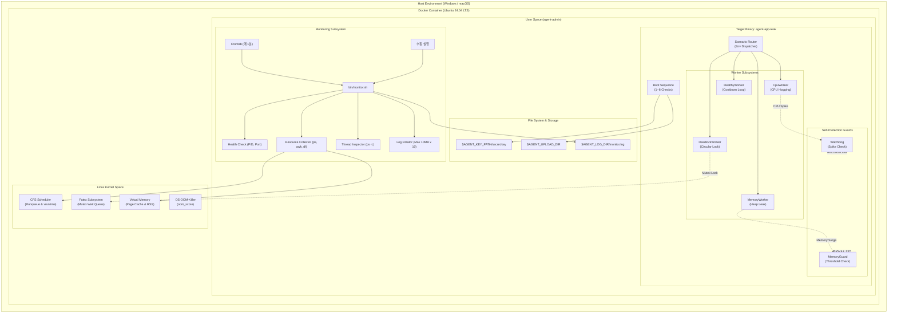
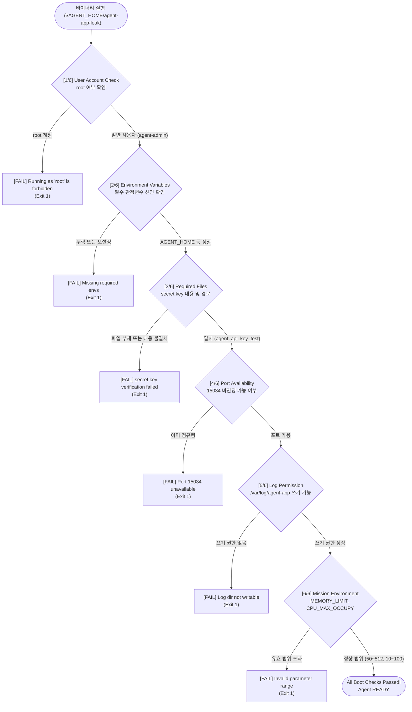
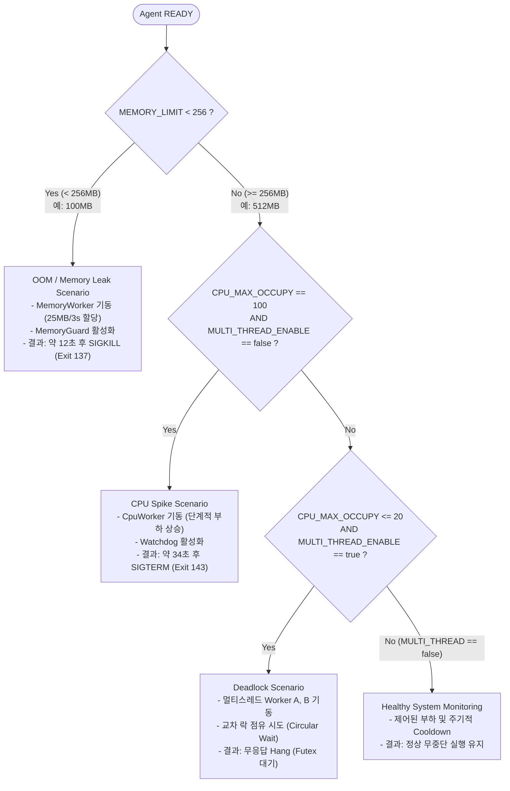
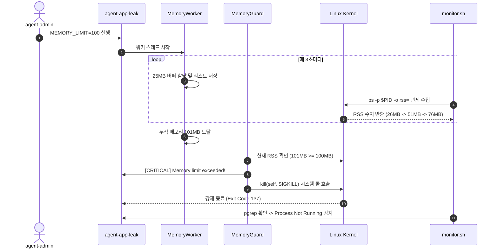
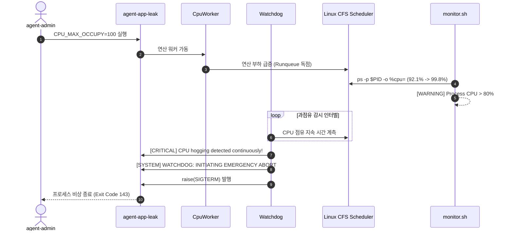
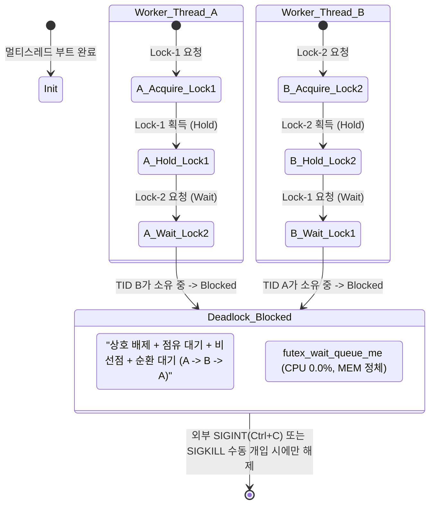
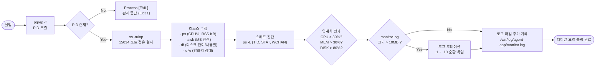

# 시스템 아키텍처 및 내부 메커니즘 분석서 (`architecture.md`)

> **대상 프로젝트**: Linux 프로세스 및 시스템 리소스 트러블슈팅 (`codyssey-b4-2`)  
> **핵심 바이너리**: [`agent-app-leak`](../agent-app-leak)  
> **관제 스크립트**: [`bin/monitor.sh`](../bin/monitor.sh)  
> **문서 목적**: 시스템 전체 계층 구조, 바이너리 내부 동작 루프, 부트 시퀀스, 시나리오 라우팅 로직, OS 커널과의 상호작용 및 관제 파이프라인을 다이어그램(Mermaid)과 함께 시각화하여 설명함.

---

## 목차
1. [시스템 전체 아키텍처](#1-시스템-전체-아키텍처)
2. [컴포넌트별 상세 설계](#2-컴포넌트별-상세-설계)
   - 2.1 [애플리케이션 계층 (`agent-app-leak`)](#21-애플리케이션-계층-agent-app-leak)
   - 2.2 [관제 및 모니터링 계층 (`monitor.sh`)](#22-관제-및-모니터링-계층-monitorsh)
   - 2.3 [운영체제 및 런타임 계층](#23-운영체제-및-런타임-계층)
3. [부트 시퀀스 및 환경 검증 흐름도](#3-부트-시퀀스-및-환경-검증-흐름도)
4. [시나리오 라우팅 및 장애 트리거 로직](#4-시나리오-라우팅-및-장애-트리거-로직)
5. [장애 유형별 내부 동작 시퀀스](#5-장애-유형별-내부-동작-시퀀스)
   - 5.1 [OOM & MemoryGuard 시퀀스](#51-oom--memoryguard-시퀀스)
   - 5.2 [CPU Spike & Watchdog 시퀀스](#52-cpu-spike--watchdog-시퀀스)
   - 5.3 [Deadlock & 순환 락 대기 상태도](#53-deadlock--순환-락-대기-상태도)
6. [관제 스크립트(`monitor.sh`) 데이터 수집 파이프라인](#6-관제-스크립트monitorsh-데이터-수집-파이프라인)

---

## 1. 시스템 전체 아키텍처

본 시스템은 Docker 컨테이너 환경의 격리된 Linux OS 위에서 실행되며, 일반 사용자 계정(`agent-admin`) 하에서 기동되는 대상 애플리케이션(`agent-app-leak`), 실시간 리소스 관제 스크립트(`bin/monitor.sh`), 그리고 cron 주기적 스케줄러로 구성됩니다.

---

## 2. 컴포넌트별 상세 설계

### 2.1 애플리케이션 계층 (`agent-app-leak`)
* **언어 및 런타임**: Python 기반 로직이 번들링된 64-bit Linux ELF 바이너리.
* **보안 및 실행 제약**: `root` 계정 실행 원천 차단 (일반 계정 강제).
* **주요 내부 모듈**:
  - **Boot Sequence Engine**: 6단계 사전 환경(사용자, 환경변수, 파일, 포트, 쓰기 권한, 파라미터 유효 범위) 검증.
  - **Scenario Dispatcher**: 환경변수(`MEMORY_LIMIT`, `CPU_MAX_OCCUPY`, `MULTI_THREAD_ENABLE`) 조합에 따라 장애 시뮬레이션 분기.
  - **MemoryWorker**: 3초마다 25MB의 더미 버퍼를 전역 메모리에 할당하여 힙 누수 유발.
  - **CpuWorker**: 부하 단계를 순차적으로 상승시켜 단일 코어를 100% 점유.
  - **DeadlockWorker**: Worker-A와 Worker-B 간의 교차 락 획득(`Resource-1`, `Resource-2`)을 통한 순환 대기 형성.
  - **MemoryGuard**: 프로세스 자체 물리 메모리(RSS)가 임계치 도달 시 커널 OOM-Killer 개입 전에 `SIGKILL` 자살 실행.
  - **Watchdog**: CPU 과점유가 지속될 경우 시스템 전면 마비를 방지하기 위해 `SIGTERM` 비상 중단 발행.

### 2.2 관제 및 모니터링 계층 (`monitor.sh`)
* **위치**: [`bin/monitor.sh`](../bin/monitor.sh)
* **주요 기능**:
  - **프로세스 생존 감시**: `pgrep -f agent-app-leak`을 통한 PID 조회.
  - **네트워크 바인딩 감시**: `ss -tulnp` 명령어를 통한 `15034` 포트 리스닝 상태 확인.
  - **정밀 리소스 수집**:
    - CPU: `ps -p $PID -o %cpu=`
    - 메모리(MB): `ps -p $PID -o rss=` 파싱 및 `awk` 1024 환산
    - 메모리 점유율(%): `ps -p $PID -o %mem=`
    - 디스크: `df /` 잔여 용량(GB) 및 점유율(%)
    - 방화벽: `ufw status` 활성화 여부
  - **스레드 레벨 세부 진단**: `ps -p $PID -L`로 스레드 수 및 각 TID별 상태(`STAT`), CPU, 커널 대기 채널(`wchan`) 추적 (Deadlock 포착용).
  - **임계치 경고 엔진**: CPU > 80%, 메모리 점유율 > 30%, 디스크 > 80% 시 `[WARNING]` 태그 출력.
  - **로그 로테이션(Log Rotation)**: 10MB 초과 시 최대 10개 파일(`monitor.log.1` ~ `monitor.log.10`) 순환 보관.

### 2.3 운영체제 및 런타임 계층
* **가상 메모리 관리자**: 물리 메모리(RSS)와 가상 메모리(VIRT) 매핑, 페이지 폴트(Page Fault) 처리 및 스왑(Swap) 제어.
* **CFS CPU 스케줄러**: 프로세스 및 스레드의 `vruntime`을 추적하여 멀티태스킹 실행 큐 관리.
* **Futex (Fast Userspace Mutex)**: 멀티스레드 락 경합 시 유저 공간 확인 후 대기 스레드를 커널 슬립 큐에 등록.

---

## 3. 부트 시퀀스 및 환경 검증 흐름도

바이너리 기동 시 순차적으로 수행되는 6단계 엄격한 검증 로직입니다.

---

## 4. 시나리오 라우팅 및 장애 트리거 로직

환경변수 값의 조합에 따라 바이너리가 내부적으로 진입하는 4가지 시나리오 결정 트리입니다.

---

## 5. 장애 유형별 내부 동작 시퀀스

### 5.1 OOM & MemoryGuard 시퀀스
메모리 누수 발생 시 애플리케이션 자체 방어 정책(`MemoryGuard`)이 시스템 전체 파괴를 방지하기 위해 개입하는 과정입니다.

---

### 5.2 CPU Spike & Watchdog 시퀀스
CPU 과점유 시 백그라운드 `Watchdog` 스레드가 시스템 반응성을 복구하기 위해 비상 중단을 수행하는 흐름입니다.

---

### 5.3 Deadlock & 순환 락 대기 상태도
멀티스레드 활성화 시 두 스레드가 교착상태에 진입하는 상태 전이 모델입니다.

---

## 6. 관제 스크립트(`monitor.sh`) 데이터 수집 파이프라인

단일 관제 실행 시 데이터가 처리되어 출력 및 저장되는 파이프라인입니다.

