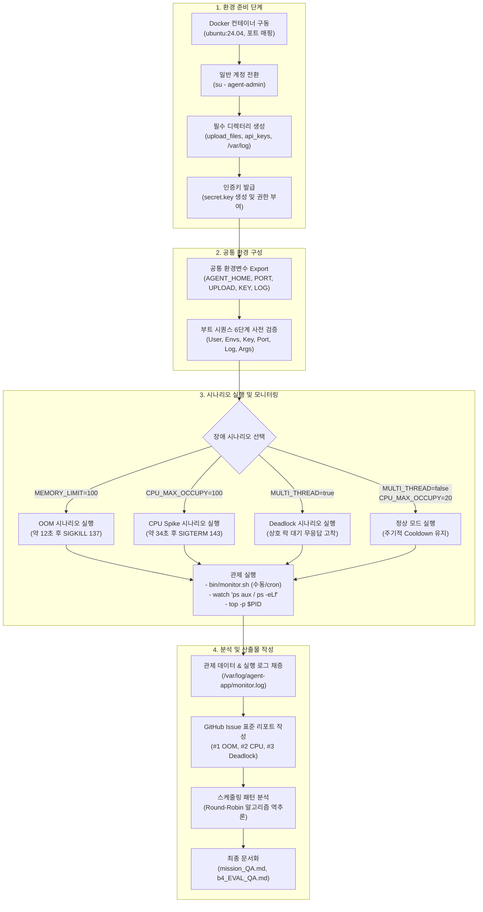

# Linux & OS 시스템 장애 분석 프로젝트 종합 가이드 (`project.md`)

> **프로젝트 명칭**: 리눅스 프로세스 및 시스템 리소스 트러블슈팅 (`codyssey-b4-2`)  
> **버전**: v1.0.0  
> **저장소 링크**: [GitHub - nttkor/b4_2](https://github.com/nttkor/b4_2)  
> **문서 목적**: 프로젝트의 개요, 폴더 구조, 전체 라이프사이클 순서도, 단계별 실행 순서 및 트러블슈팅 절차를 상세히 안내함.

---

## 목차
1. [프로젝트 개요](#1-프로젝트-개요)
   - 1.1 [배경 및 목적](#11-배경-및-목적)
   - 1.2 [해결 대상 핵심 장애 과제](#12-해결-대상-핵심-장애-과제)
   - 1.3 [기술 스택 및 인프라 사양](#13-기술-스택-및-인프라-사양)
2. [폴더 및 파일 구조](#2-폴더-및-파일-구조)
   - 2.1 [전체 디렉터리 트리](#21-전체-디렉터리-트리)
   - 2.2 [파일별 상세 기능 명세](#22-파일별-상세-기능-명세)
3. [프로젝트 전체 작업 순서도](#3-프로젝트-전체-작업-순서도)
4. [단계별 상세 실행 순서 (Execution Guide)](#4-단계별-상세-실행-순서-execution-guide)
   - [Step 1] [도커 컨테이너 환경 진입 및 계정 전환](#step-1-도커-컨테이너-환경-진입-및-계정-전환)
   - [Step 2] [필수 디렉터리 및 인증 파일 초기화](#step-2-필수-디렉터리-및-인증-파일-초기화)
   - [Step 3] [공통 환경변수 설정](#step-3-공통-환경변수-설정)
   - [Step 4] [시나리오별 프로세스 실행 및 재현](#step-4-시나리오별-프로세스-실행-및-재현)
   - [Step 5] [관제 스크립트 실행 및 Crontab 자동화](#step-5-관제-스크립트-실행-및-crontab-자동화)
   - [Step 6] [멀티 터미널 실시간 관제 및 로깅 확인](#step-6-멀티-터미널-실시간-관제-및-로깅-확인)
5. [시나리오 매트릭스 및 파라미터 규격](#5-시나리오-매트릭스-및-파라미터-규격)
6. [관련 산출물 및 문서 인덱스](#6-관련-산출물-및-문서-인덱스)

---

## 1. 프로젝트 개요

### 1.1 배경 및 목적
서버 운영 환경에서 가장 빈번하면서도 치명적인 장애는 **Memory Leak(메모리 누수)**, **CPU Spike(과점유)**, **Deadlock(교착상태)**입니다. 본 프로젝트는 빌드된 단일 바이너리(`agent-app-leak`)를 실제 리눅스 환경에서 구동하며 발생하는 시스템 리소스 고갈 현상을 관제 스크립트(`monitor.sh`)와 표준 시스템 도구(`ps`, `top`, `df`, `ss`)를 활용하여 포착하고, 체계적인 기술 리포트(GitHub Issue)로 작성 및 완화(Workaround)하는 트러블슈팅 역량을 체득하기 위해 구축되었습니다.

### 1.2 해결 대상 핵심 장애 과제
1. **OOM Crash (Memory Leak)**: 프로세스 힙 누적으로 인한 메모리 한계 도달 및 자가 보호 정책(`MemoryGuard`)에 의한 강제 종료(`SIGKILL`) 규명.
2. **CPU Latency & Spike**: 단일 워커의 무한 연산 루프로 인한 코어 100% 과점유 및 비상 중단(`Watchdog` `SIGTERM`) 규명.
3. **Deadlock (무응답 행)**: 멀티스레드 상호 배제(Mutex) 락 경합으로 인한 순환 대기 및 프로세스 프리징(`futex` 슬립) 규명.
4. **스케줄링 알고리즘 역추론 (보너스)**: 스레드 작업 진행 로그를 타임스탬프 기반으로 분석하여 런타임 스케줄러 기법 도출.

### 1.3 기술 스택 및 인프라 사양
* **운영체제**: Ubuntu 24.04 LTS (Docker Container)
* **컨테이너 런타임**: Docker Engine v29.x
* **셸 환경**: GNU Bash 5.2+
* **대상 바이너리**: Linux 64-bit ELF (Python 번들 바이너리, x86_64)
* **모니터링 툴셋**: `ps`, `top`, `awk`, `ss`, `df`, `cron`, `ufw`

---

## 2. 폴더 및 파일 구조

### 2.1 전체 디렉터리 트리
```text
b4_2/
├── .git/                      # Git 버전 관리 메타데이터
├── .DS_Store                  # macOS 메타데이터 (무시 대상)
├── README.md                  # 프로젝트 메인 리포트 및 빠른 시작 가이드
├── agent-app-leak             # [실행 대상] 분석 대상 바이너리 (Linux ELF 64-bit, 7.9MB)
├── bin/
│   └── monitor.sh             # [관제 핵심] 프로세스 리소스 감시 및 로그 로테이션 셸 스크립트
└── docs/                      # 프로젝트 기술 문서 및 평가 자료 보관소
    ├── b4_2_mission.pdf       # 원본 미션 가이드 문서
    ├── b4_2_Eval.pdf          # 원본 평가표 및 심층 질문지
    ├── mission_QA.md          # 미션 목표 및 기능 요구사항 종합 Q&A 보고서
    ├── b4_EVAL_QA.md          # 평가표 전 문항 답변 및 상대 경로 매핑 문서
    ├── architecture.md        # 시스템 아키텍처 및 내부 메커니즘 분석서
    ├── achitecture.md         # architecture.md와 동일 파일 (파일명 호환용)
    └── project.md             # [본 문서] 프로젝트 종합 개요 및 실행 순서도 가이드
```

### 2.2 파일별 상세 기능 명세

| 파일 경로 | 구분 | 상세 역할 및 설명 |
|---|---|---|
| [`agent-app-leak`](../agent-app-leak) | 실행 바이너리 | 6단계 부트 시퀀스를 거쳐 환경변수에 따라 OOM, CPU 과점유, 데드락, 정상 모드를 시뮬레이션하는 핵심 바이너리 |
| [`bin/monitor.sh`](../bin/monitor.sh) | 관제 스크립트 | 대상 프로세스의 PID, 포트, CPU%, RSS 메모리(MB), 디스크 잔여량, 방화벽 상태, 스레드(TID) 정보를 실시간 채증 및 로테이션 기록 |
| [`README.md`](../README.md) | 매뉴얼 | 프로젝트 실행 환경, 환경변수 정의, 6단계 부트 시퀀스 명세, 시나리오별 실행 명령어 및 cron 설정법 수록 |
| [`docs/architecture.md`](./architecture.md) | 설계 분석서 | 호스트-컨테이너-커널 계층 구조, 바이너리 내부 모듈(MemoryGuard, Watchdog), 시나리오 라우팅 플로우차트, 순서도 수록 |
| [`docs/mission_QA.md`](./mission_QA.md) | 미션 보고서 | 미션 목표 4가지 및 기능 요구사항에 대한 심층 기술 답변, 3건의 GitHub Issue 표준 리포트 수록 |
| [`docs/b4_EVAL_QA.md`](./b4_EVAL_QA.md) | 평가 답변서 | 평가표(Eval)의 항목 1~5 전 문항에 대한 판정(PASS), 이론적 근거, 소스 코드 라인별 상대 링크 수록 |
| [`docs/project.md`](./project.md) | 종합 가이드 | 프로젝트의 전체 흐름, 파일 카탈로그, 단계별 실행 순서 가이드 |

---

## 3. 프로젝트 전체 작업 순서도

프로젝트 준비부터 환경 세팅, 시나리오 실행, 실시간 관제, 트러블슈팅 보고서 작성까지의 전체 엔지니어링 라이프사이클입니다.



---

## 4. 단계별 상세 실행 순서 (Execution Guide)

### [Step 1] 도커 컨테이너 환경 진입 및 계정 전환

1. **컨테이너 진입**:
   ```bash
   docker exec -it agent-leak-lab bash
   ```
2. **일반 계정(`agent-admin`) 전환**:
   * 바이너리는 보안 정책상 `root` 계정 실행을 차단하므로 반드시 전용 계정으로 전환합니다.
   ```bash
   su - agent-admin
   whoami  # agent-admin 확인
   ```
   > ⚠️ **주의**: `sudo -u agent-admin bash -c ...` 형태를 쓰면 `sudo` 실행 시 환경변수가 초기화되므로 반드시 `su - agent-admin`으로 대화형 셸에 진입한 후 작업합니다.

---

### [Step 2] 필수 디렉터리 및 인증 파일 초기화

1. **디렉터리 구조 생성**:
   ```bash
   mkdir -p /home/agent-admin/agent-app/upload_files
   mkdir -p /home/agent-admin/agent-app/api_keys
   sudo mkdir -p /var/log/agent-app
   sudo chown -R agent-admin:agent-admin /var/log/agent-app
   ```
2. **API 인증키(`secret.key`) 생성**:
   ```bash
   echo -n "agent_api_key_test" > /home/agent-admin/agent-app/api_keys/secret.key
   chmod 600 /home/agent-admin/agent-app/api_keys/secret.key
   ```

---

### [Step 3] 공통 환경변수 설정

로그인 세션에서 아래 공통 환경변수를 export 합니다.
```bash
export AGENT_HOME=/home/agent-admin/agent-app
export AGENT_PORT=15034
export AGENT_UPLOAD_DIR=/home/agent-admin/agent-app/upload_files
export AGENT_KEY_PATH=/home/agent-admin/agent-app/api_keys
export AGENT_LOG_DIR=/var/log/agent-app
```

---

### [Step 4] 시나리오별 프로세스 실행 및 재현

#### 1. 시나리오 A: OOM (메모리 누수) 재현
```bash
# 약 12초 내 100MB 도달하여 SIGKILL 강제 종료
export MEMORY_LIMIT=100 CPU_MAX_OCCUPY=100 MULTI_THREAD_ENABLE=false
$AGENT_HOME/agent-app-leak
echo "종료 코드: $?"  # 137 확인 (SIGKILL)
```

* **완화 및 검증 (After)**:
```bash
# 한계치를 512MB로 상향하여 생존 시간 65초 이상으로 연장
export MEMORY_LIMIT=512 CPU_MAX_OCCUPY=100 MULTI_THREAD_ENABLE=false
$AGENT_HOME/agent-app-leak
```

#### 2. 시나리오 B: CPU 과점유 (Spike) 재현
```bash
# 약 34초 내 CPU 100% 도달하여 Watchdog에 의해 SIGTERM 비상 종료
export MEMORY_LIMIT=512 CPU_MAX_OCCUPY=100 MULTI_THREAD_ENABLE=false
$AGENT_HOME/agent-app-leak
echo "종료 코드: $?"  # 143 확인 (SIGTERM)
```

* **완화 및 검증 (After)**:
```bash
# CPU 점유율 상한을 20%로 제어하여 정상 모드로 전환
export MEMORY_LIMIT=512 CPU_MAX_OCCUPY=20 MULTI_THREAD_ENABLE=false
$AGENT_HOME/agent-app-leak
```

#### 3. 시나리오 C: Deadlock (교착상태) 재현
```bash
# POTENTIAL DEADLOCK 경고 출력 후 무응답 Hang 상태 진입 (스레드 futex 고착)
export MEMORY_LIMIT=512 CPU_MAX_OCCUPY=20 MULTI_THREAD_ENABLE=true
$AGENT_HOME/agent-app-leak
# (확인 후 Ctrl + C로 수동 종료)
```

* **완화 및 검증 (After)**:
```bash
# 단일 스레드로 전환하여 락 경합 조건 완전 제거
export MEMORY_LIMIT=512 CPU_MAX_OCCUPY=20 MULTI_THREAD_ENABLE=false
$AGENT_HOME/agent-app-leak
```

---

### [Step 5] 관제 스크립트 실행 및 Crontab 자동화

#### 1. 수동 1회 실행
```bash
/home/agent-admin/agent-app/bin/monitor.sh
```

#### 2. Crontab 매 1분 자동 관제 등록
`agent-admin` 계정에서 `crontab -e`를 실행하고 아래 내용을 등록합니다:
```cron
* * * * * AGENT_PORT=15034 AGENT_LOG_DIR=/var/log/agent-app /home/agent-admin/agent-app/bin/monitor.sh >> /var/log/agent-app/monitor-cron.log 2>&1
```

* **등록 확인**:
```bash
crontab -l
```

---

### [Step 6] 멀티 터미널 실시간 관제 및 로깅 확인

별도의 터미널 창을 열어 컨테이너에 접속한 후 아래 명령어로 프로세스를 정밀 관찰합니다.

1. **실시간 프로세스 상태 모니터링**:
   ```bash
   watch -n 1 'ps aux | grep agent-app-leak | grep -v grep'
   ```
2. **스레드 세부 상태 및 Deadlock 감시**:
   ```bash
   watch -n 1 'ps -eLf | grep agent-app-leak | grep -v grep'
   ```
3. **CPU / 메모리 순간 사용률 추적**:
   ```bash
   top -p $(pgrep -f agent-app-leak | head -1)
   ```
4. **관제 로그 스트리밍**:
   ```bash
   tail -f /var/log/agent-app/monitor.log
   ```
5. **임계치 경고 로그 필터링**:
   ```bash
   grep WARNING /var/log/agent-app/monitor.log
   ```

---

## 5. 시나리오 매트릭스 및 파라미터 규격

| 시나리오명 | `MEMORY_LIMIT` | `CPU_MAX_OCCUPY` | `MULTI_THREAD_ENABLE` | 종료 증상 및 상태 코드 | 핵심 로그 키워드 |
|---|---|---|---|---|---|
| **OOM Crash** | `< 256` (예: 100) | 100 | false | **강제 종료 (Exit 137)**<br>약 12초 후 종료 | `[MemoryGuard] Memory limit exceeded`<br>`SELF-TERMINATED` |
| **CPU Spike** | `>= 256` (예: 512) | `100` | false | **비상 중단 (Exit 143)**<br>약 34초 후 종료 | `[Watchdog] CPU hogging detected`<br>`EMERGENCY ABORT (SIGTERM)` |
| **Deadlock** | `>= 256` (예: 512) | `<= 20` (예: 20) | **true** | **무응답 Hang (PID 유지)**<br>CPU 0%, 종료 안 됨 | `WAITING... BLOCKED`<br>`POTENTIAL DEADLOCK DETECTED` |
| **Healthy Monitoring** | `>= 256` (예: 512) | `<= 20` (예: 20) | **false** | **정상 실행 지속**<br>종료 없음 | `Cooldown completed`<br>`System Healthy` |

---

## 6. 관련 산출물 및 문서 인덱스

* 📘 [미션 가이드 (PDF)](./b4_2_mission.pdf) : 교육기관 공식 미션 명세서
* 📝 [평가표 원본 (PDF)](./b4_2_Eval.pdf) : 미션 평가 기준 및 심화 문항지
* 📊 [미션 종합 Q&A 보고서](./mission_QA.md) : 목표/기능요구사항 답변 및 GitHub Issue 템플릿 리포트 전문
* 🎯 [평가표 전 문항 답변서](./b4_EVAL_QA.md) : 평가표 질문별 PASS 증거 및 소스 코드 상대 링크 매핑
* 🏛️ [시스템 아키텍처 분석서](./architecture.md) : 시스템 구조도, 부트 시퀀스 및 상태 전이도 (Mermaid)
